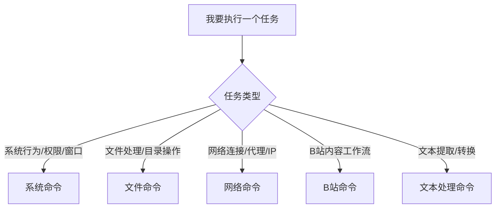

# 按用途选命令

<TkVpContainer type="info" title="阅读方式" text="先按用途定位，再看风险等级，最后进入具体命令章节搜索关键词。" />

## 1) 先判断你的任务类型

## 2) 再判断你的版本与风险承受

| 判断问题 | 选择建议 |
| :-- | :-- |
| 你是普通版用户吗？ | 先用普通可用命令，看到 `PRO` 标记先跳过。 |
| 你是否在生产环境机器操作？ | 避免高风险命令，先在测试机验证。 |
| 你是否明确知道回滚方式？ | 不明确就先别执行系统策略/权限类命令。 |

## 3) 章节跳转

- [系统命令](/commands/system-commands)
- [文件命令](/commands/file-commands)
- [网络命令](/commands/network-commands)
- [B站命令](/commands/bili-commands)
- [文本处理命令](/commands/text-processing-commands)

## 4) 常用场景速查

### 场景 A：我只想做低风险效率操作

优先阅读：文件命令、文本处理命令。  
典型操作：重命名、批量整理、文本替换、格式化。

### 场景 B：我需要系统级能力（进程/权限）

优先阅读：系统命令 + 安全边界。  
先做：备份配置 -> 单命令验证 -> 记录变更。

### 场景 C：我做内容创作，主要用 B 站能力

优先阅读：B站命令章节。  
建议结合：BetterLyrics、FAQ 页面排障。
